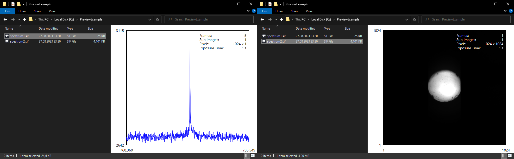

# SIFPreviewHandler - SIF Preview Handler for Windows Explorer

This preview handler allows viewing spectra stored in the .sif file format directly in the preview pane of Windows Explorer or other compatible preview handler hosts. It uses proprietary library files from the [SIFReaderSDK](https://andor.oxinst.com/downloads/view/viewer:-sif-reader-sdk-2.104.30065.0), [Andor Solis](https://andor.oxinst.com/downloads/view/andor-solis-64-bit-4.32.30065.0), or [Andor SDK](https://andor.oxinst.com/downloads/view/andor-sdk-2.104.30084.0) installations. Please note that it has been developed and tested on a Windows 10 system (version 10.0.19045 Build 19045) and its compatibility with other Windows-based systems cannot be guaranteed. It is also not compatible with systems older than Windows Vista.

## Files

- **SIFPreviewHandler.dll**: The main preview handler library file.
- **ATSIFIO64.dll**: Proprietary library file provided by Andor (see also sec. '[Development](#development)' below).
- **atspooler.dll**: Proprietary library file provided by Andor (see also sec. '[Development](#development)' below).
- **install.bat**: Script to register the preview handler with the operating system.
- **uninstall.bat**: Script to unregister the preview handler from the operating system.

## Installation

To install the SIF Preview Handler, follow these steps:

1. Download the latest [release](https://github.com/dfpsoeew/SIFPreviewHandler/releases). The archive `SIFPreviewHandler.zip` contains all the files mentioned in sec. '[Files](#files)' above.
2. Unpack the files into a folder on your system. This folder must remain present for the preview handler to work and cannot be deleted until the handler is uninstalled.
3. Run **install.bat** (double click) to register the preview handler. Note that the screen may turn black during the installation process as Windows Explorer is restarted.
4. Enable the preview pane in Windows Explorer by clicking the *View* tab in any Explorer window and selecting *Preview pane*.

## Uninstall

To uninstall the SIF Preview Handler, follow these steps:

1. Run **uninstall.bat** (double click) to unregister the preview handler.
2. All copied files can now be deleted manually.

## Versions

### 1.0 (2023-09-12)
- Initial version

## Development

This project relies heavily on the example provided by Microsoft, which can be found [here](https://github.com/microsoft/Windows-classic-samples/tree/main/Samples/Win7Samples/winui/shell/appshellintegration/RecipePreviewHandler), as well as the code example available [here](https://github.com/microsoft/Windows-classic-samples/tree/main/Samples/Win7Samples/winui/shell/appshellintegration/RecipePreviewHandler).

### Get the necessary files

To build **SIFPreviewHandler.dll**, you need to add several files to the project folder yourself due to license agreements. You can get them from the free downloadable packages [SIFReaderSDK](https://andor.oxinst.com/downloads/view/viewer:-sif-reader-sdk-2.104.30065.0), [Andor Solis](https://andor.oxinst.com/downloads/view/andor-solis-64-bit-4.32.30065.0), or [Andor SDK](https://andor.oxinst.com/downloads/view/andor-sdk-2.104.30084.0). They are located in the respective installation folder `C:\Program Files\<Andor Software Name>\SIF Reader\SIFReaderSDK\`. These files are required:

- **ATLibraryExport.h**
- **ATPrimitiveTypes.h**
- **ATSIFErrorCodes.h**
- **ATSIFIO.h**
- **ATSIFIO64.a**
- **ATSIFIO64.dll** (Provided in this [release](https://github.com/dfpsoeew/SIFPreviewHandler/releases) as well, since it will be released in a future [Andor Driver Pack](https://andor.oxinst.com/downloads/view/andor-driver-pack-2.104.30065.0-(ccd,iccd-emccd)), which does not require any license agreements)
- **ATSIFIO64.lib**
- **ATSIFProperties.h**
- **ATSIFTypes.h**
- **atspooler.dll** (Provided in this [release](https://github.com/dfpsoeew/SIFPreviewHandler/releases) as well, since it will be released in a future [Andor Driver Pack](https://andor.oxinst.com/downloads/view/andor-driver-pack-2.104.30065.0-(ccd,iccd-emccd)), which does not require any license agreements)

### Build the solution (similar to [this](https://github.com/microsoft/Windows-classic-samples/tree/main/Samples/Win7Samples/winui/shell/appshellintegration/RecipePreviewHandler) example)

#### To build the solution from the command prompt:
1. Open the command prompt window and navigate to the directory.
2. Run `msbuild SIFPreviewHandler.sln`

#### To build the solution using Visual Studio 2022 (preferred method):
1. Open Windows Explorer and navigate to the directory.
2. Double-click the `SIFPreviewHandler.sln` file to open it in Visual Studio.
3. From the Build menu, select Build Solution. The DLL will be built in the default `\Debug` or `\Release` directory.

## ToDo

- Investigate options for displaying the grating used to record the spectrum. Currently there is no way to get this information through the Andor interfaces.
- Fix non-linear scaling problem in color map plots where wavelength values are displayed on the x-axis instead of pixel numbers. Resampling the bitmap may be required to resolve this.
- In the case of a kinetic series, create a user interface that allows scrolling through the individual spectra.